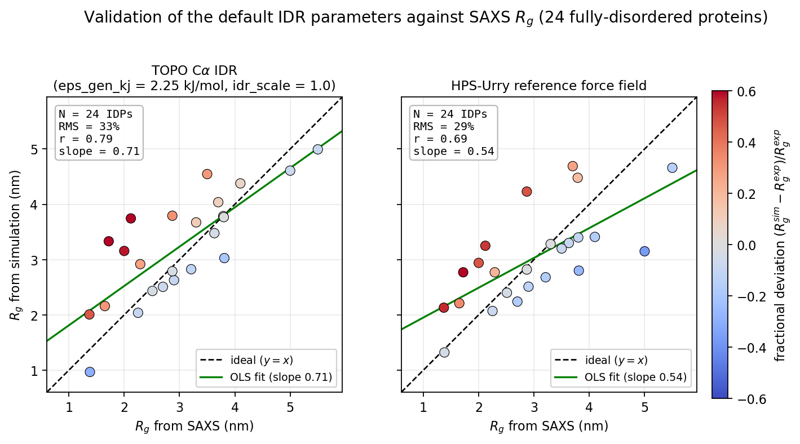

Disordered / IDR regions
========================

TOPO can mark part (or all) of a chain as an **intrinsically disordered region
(IDR)** — a stretch with no stable fold. A disordered region is declared as an
optional ``disordered:`` section **inside the same** :doc:`domain_def file
<domain_definition>` you already pass through ``domain_def``; there is no
separate file, argument, or INI key. This page explains **how the model treats a
disordered region** (the physics) and **how you define one** (the YAML).

.. note::

   **Scope.** This is the α-carbon (Cα) model only. The disordered treatment is
   applied by :func:`topo.utils.nonbonded.apply_disorder` at the end of the
   non-bonded build, and is picked up automatically by isolated-protein
   simulations, the native-contact (Q) analysis, the nscale optimizer, and
   continuous synthesis (CSP) — all from the one ``disordered:`` section.

The idea in one paragraph
-------------------------

In TOPO the local backbone (3.81 Å bonds, the double-well transferable angle, and
the Karanicolas transferable dihedral) is **already** the disorder-appropriate,
non-Gō backbone for *every* residue — see :doc:`model_theory`. What makes a
residue in a folded domain *folded* is therefore **only** its native (Gō) contacts. Marking a
region disordered means: **remove its native contacts** and replace them with a
weak, non-specific attraction, while keeping self-avoidance. Nothing about the
bonds, angles, dihedrals, electrostatics, or the OpenMM force objects changes —
the entire feature is a per-residue contact mask applied to the non-bonded energy
and well-position matrices.

How a disordered region is treated in the model
-----------------------------------------------

Every residue **pair** falls into exactly one of three classes, decided by how
many of its two residues are in the disorder mask. Only the pair's well **depth**
and well **position** differ between classes; they all use the *same* single
12-10-6 term the model already has (:ref:`theory-contacts`) — no new force is
added.

.. list-table::
   :header-rows: 1
   :widths: 18 14 40 28

   * - Pair class
     - Native (Gō) contacts
     - Well depth :math:`\varepsilon_{ij}`
     - Well position :math:`R_{ij}`
   * - **folded–folded**
       (neither residue in the mask)
     - kept (Gō)
     - unchanged — H-bond + backbone–sidechain + scaled sidechain–sidechain,
       else the non-native floor
     - native Cα distance, else the Karanicolas–Brooks (K–B) sum rule
   * - **IDR–IDR**
       (both residues in the mask)
     - removed
     - :math:`\max\!\bigl(\varepsilon_\mathrm{NN},\ \varepsilon_\mathrm{gen} +
       s_\mathrm{IDR}\,\varepsilon_\mathrm{BT}\bigr)` (defined below)
     - :math:`r_\mathrm{vdw}` + :math:`r_\mathrm{vdw}` (sum rule)
   * - **folded–IDR**
       (exactly one residue in the mask)
     - removed
     - :math:`\varepsilon_\mathrm{NN}` — **excluded-volume only**
     - K–B + :math:`r_\mathrm{vdw}` (sum rule)

where :math:`\varepsilon_\mathrm{gen}` is the ``eps_gen_kj`` generic-cohesion depth,
:math:`s_\mathrm{IDR}` is the ``idr_scale`` knob,
:math:`\varepsilon_\mathrm{NN}` is the non-native floor
(:math:`1.32\times10^{-4}` kcal/mol), and :math:`\varepsilon_\mathrm{BT}(i,j)` is
the **sidechain–sidechain BT interaction energy** for the two residue types — the
*same* per-pair energy the model uses for native SS contacts, namely

.. math::

   \varepsilon_\mathrm{BT}(i,j) \;=\; 4.184 \cdot
   \bigl|\,\mathrm{raw}(i,j) - 0.6\,\bigr| \quad\text{[kJ/mol]},

i.e. the raw ``bt_potential.csv`` value shifted by the 0.6 kcal/mol reference,
made positive with :math:`|\cdot|`, and converted kcal→kJ (this is exactly
:func:`topo.utils.nonbonded.get_ss_interaction_energy`) — **not** the bare CSV
number.

**Depth — two additive channels.** Within a disordered region every non-local
pair gets

.. math::

   \varepsilon_{ij}^\mathrm{IDR} \;=\; \max\!\bigl(\varepsilon_\mathrm{NN},\;
   \underbrace{\varepsilon_\mathrm{gen}}_{\text{generic}} \;+\;
   \underbrace{s_\mathrm{IDR}\,\varepsilon_\mathrm{BT}(i,j)}_{\text{sequence-dependent}}\bigr)

* :math:`\varepsilon_\mathrm{BT}(i,j)` carries the **sequence dependence**. It is
  *non-specific in coverage* (it acts on every non-local IDR–IDR pair, not just
  would-be native contacts) but *chemically heterogeneous in depth* — the BT energy
  varies by residue-pair type, so a hydrophobic pair attracts more strongly than a
  polar one. ``idr_scale`` (:math:`s_\mathrm{IDR}`) scales this channel.
* :math:`\varepsilon_\mathrm{gen}` (``eps_gen_kj``) is a **sequence-independent**
  cohesion depth applied equally to every IDR–IDR pair. It stands in for the
  backbone–backbone and backbone–sidechain attraction that a Cα-only model has no
  explicit channel for.

Together the two set **how compact the disordered chain is**: :math:`\varepsilon_
\mathrm{gen}` fixes the overall level of collapse and :math:`s_\mathrm{IDR}\,
\varepsilon_\mathrm{BT}` modulates it residue-pair by residue-pair. ``eps_gen_kj`` is
the knob to turn first when you want to tune compaction.

Physically this is a weak, non-fold-encoding attraction — a collapsing
self-avoiding chain, **not** a Gō fold. The :math:`\max(\varepsilon_\mathrm{NN},
\cdot)` floor guarantees excluded volume even when both channels vanish (and for the
handful of pairs whose :math:`\varepsilon_\mathrm{BT}\approx 0`), so the chain can
never pass through itself.

.. note::

   **The depth carries no nscale factor.** The IDR depth uses the
   :math:`\varepsilon_\mathrm{BT}` matrix above (unscaled by any domain factor),
   **not** the domain-scaled sidechain energy. In TOPO ``nscale`` is the per-domain
   folding-**stability** ladder (:doc:`stability_optimization`); an IDR has no fold and
   no stability target, so it does not inherit a ladder value (effectively
   ``nscale = 1`` for IDR pairs).

   So at the default ``idr_scale = 1.0`` an IDR–IDR pair gets a sequence-dependent
   attraction equal to **the unscaled (nscale = 1) sidechain–sidechain interaction
   energy** that the *same pair of residue types* would carry as a native contact —
   typically ~1 kJ/mol on average.
   Read that against the **raw** SS energy, not against a folded domain's contacts:
   a real domain additionally scales its SS contacts by its own ``nscale``
   (typically > 1), so relative to *that* the IDR attraction is weaker still.

**Position — the excluded-volume radius.** The collision radius is a property of
the **residue**. For a residue in an IDR region the structure-derived K–B radius is
meaningless (its input coordinates do not define a fold), so those residues switch
to the **transferable per-AA** van der Waals radius :math:`r_\mathrm{vdw}`.
Residues in folded domains keep their K–B
:math:`R_\mathrm{min}/2` unchanged. Pairs then combine by the plain sum rule, so

.. math::

   R_{ij} = \begin{cases}
     R_\mathrm{min}/2_i + R_\mathrm{min}/2_j & \text{folded–folded}\\
     R_\mathrm{min}/2_i + r_\mathrm{vdw}(j) & \text{folded–IDR}\\
     r_\mathrm{vdw}(i) + r_\mathrm{vdw}(j) & \text{IDR–IDR}
   \end{cases}

Note that a residue in a folded domain keeps its *native* radius even when it meets
a residue in an IDR region —
it is not shrunk in cross pairs. Because the conversion is applied to the
**per-residue radius array**, the same radius reaches both the intra-chain and (for
synthesis) the nascent↔ribosome excluded-volume channels — they cannot disagree. No
new parameter file is shipped.

**What does not change.** Bonds, angles, dihedrals, and Yukawa electrostatics are
untouched (the global transferable backbone is already the disordered-appropriate
choice). The ``CustomNonbondedForce`` construction is unchanged — it consumes the
same two matrices. A run with **no** ``disordered:`` section is byte-for-byte
identical to before the feature existed; even *with* a section, folded–folded
pairs and the K–B radius of every residue in a folded domain are untouched.

Defining a disordered region in ``domain.yaml``
-----------------------------------------------

Add a ``disordered:`` block to the domain_def file. All three top-level sections
(``intra_domains``, ``inter_domains``, ``disordered``) are **optional**; only
``n_residues`` is required.

.. important::

   **Deciding which residues are disordered.** Choosing the disordered residues is
   **your responsibility** — TOPO applies exactly the set you list in
   ``residues:`` and makes no attempt to detect disorder itself. The definition of
   an IDR is model-dependent, so the ranges you commit to are a modeling choice you
   should be able to justify. The following are common **sources to inform that
   decision** (not automatic assignments):

   * **MobiDB** (`<https://mobidb.org/>`_) — a database of protein disorder and
     mobility that aggregates curated and predicted intrinsically disordered
     regions. Look up your protein by its UniProt accession to see candidate
     disordered ranges.
   * **AlphaFold pLDDT < 70** — residues whose AlphaFold per-residue confidence
     (pLDDT) falls below **70** are a widely used proxy for disorder: low-confidence
     stretches correspond closely to intrinsically disordered regions. This is the
     threshold used to define IDRs at proteome scale in Tesei *et al.* [Tesei2024]_.
     The pLDDT is stored in the B-factor column of the AlphaFold model.

   Both report 1-based residue numbers. Treat them as evidence, reconcile them
   against your own knowledge of the system, and then enter the ranges **you**
   decide on into the ``residues:`` list below.

.. code-block:: yaml

    n_residues: 283

    # --- domain scaling of native side-chain contacts (optional, unchanged) ---
    intra_domains:
      A: { residues: [25-149],  nscale: 1.0 }
      B: { residues: [150-283], nscale: 1.0 }
    inter_domains:
      A-B: 0.5

    # --- disordered / IDR region (optional) ---
    disordered:
      residues: [1-24, 150-165]   # native contacts removed for these residues
      eps_gen_kj: 2.25            # OPTIONAL, defaults to 2.25 kJ/mol if omitted
      idr_scale: 1.0              # OPTIONAL, defaults to 1.0 if omitted

The residue-list syntax is exactly the one used everywhere else in the file:
inclusive ranges as strings (``"1-24"``), bare integers, or a mix
(``[1, 2, "5-10", 150-165]``). Numbering is 1-based and matches the input PDB.

Field reference
~~~~~~~~~~~~~~~

.. list-table::
   :header-rows: 1
   :widths: 24 12 16 48

   * - Key
     - Required?
     - Type (default)
     - Meaning / allowed values
   * - ``disordered``
     - no
     - mapping (absent)
     - Presence of this block turns on the IDR treatment. Omit it entirely for a
       fully-folded protein (then the run is byte-identical to before).
   * - ``disordered.residues``
     - **yes** (if the block is present)
     - list (—)
     - Residues to mark disordered. Same syntax as a domain's ``residues``:
       ranges (``"1-24"``, inclusive), bare integers, or a mix. Their native
       contacts are removed.
   * - ``disordered.eps_gen_kj``
     - no
     - float (``2.25``)
     - The generic-cohesion depth :math:`\varepsilon_\mathrm{gen}` (kJ/mol), added to
       every IDR–IDR well. **Defaults to 2.25** when omitted — the calibrated value
       (:ref:`idr-validation`). This is the knob for tuning how compact the
       disordered chain is: raise it to compact, lower it to expand. folded–IDR pairs
       are always excluded-volume only regardless of this value.
   * - ``disordered.idr_scale``
     - no
     - float (``1.0``)
     - The scale :math:`s_\mathrm{IDR}` on the sequence-dependent BT channel.
       **Defaults to 1.0** when omitted (the calibrated value). Set **both** this and
       ``eps_gen_kj`` to ``0`` for a pure self-avoiding chain.

Overlap with a domain is allowed — disorder wins
~~~~~~~~~~~~~~~~~~~~~~~~~~~~~~~~~~~~~~~~~~~~~~~~~~

A ``disordered:`` range **may overlap** an ``intra_domains`` range. The disorder
transform runs *after* the whole folded build (including domain scaling), so for
any pair touching a disordered residue the domain ``nscale`` is computed and then
**discarded** — the pair is governed entirely by the disorder rules. In other
words: **if either residue of a pair is disordered, disorder governs it**, no
matter which domains the two residues belong to.

This makes overlap a convenience — define a domain broadly and carve a disordered
loop out of it without splitting the domain:

.. code-block:: yaml

    n_residues: 100
    intra_domains:
      A: { residues: [1-100], nscale: 1.6871 }   # one domain over the whole chain ...
    disordered:
      residues: [40-50]                           # ... with a disordered loop carved out

Here residues 40–50 are disordered (their ``nscale`` has no effect); the rest of
domain A folds as **one unit with a hole**, still joined across the loop by its
40↔ folded and 50↔ folded backbone bonds and by the retained 1–39 ↔ 51–100
contacts. The reader prints an **info** line listing any overlapping residues, so
an accidental double-listing is visible (it is not an error — overlap is legal).

Tuning the compaction
---------------------

* **The defaults are calibrated** (``eps_gen_kj = 2.25``, ``idr_scale = 1.0``) — use
  them unless you have a specific reason not to. They were fit against SAXS
  :math:`R_g` for 24 fully-disordered proteins (:ref:`idr-validation`). A chain with
  no attraction at all systematically **over-expands** most IDPs: SAXS/smFRET place
  them at scaling exponent :math:`\nu \approx 0.5\text{–}0.55`, versus
  :math:`\nu \approx 0.588` for a self-avoiding walk. The non-specific attraction
  reweights the same broad, flexible ensemble toward the observed compaction
  **without** locking in a fold. Because TOPO's Debye–Hückel electrostatics are
  always on (a repulsive term for charged chains), the balanced physical picture is
  *repulsion balanced by weak attraction*.
* **To tune compaction, move** ``eps_gen_kj`` **first.** Raising it compacts every
  chain, lowering it expands them.
* **Self-avoiding is the better call** for: a disordered **linker** whose role is
  reach / entropic tethering (compaction is not the observable); a **strongly
  charged, highly expanded** IDP that genuinely approaches self-avoiding-walk
  statistics; or a deliberately minimal, assumption-free reference ensemble. Set
  **both** ``eps_gen_kj: 0`` and ``idr_scale: 0`` — zeroing one alone leaves the other
  channel on.
* **Re-calibrate when you can.** If you have SAXS/smFRET :math:`R_g` or :math:`\nu`
  for *your* system, treat ``eps_gen_kj`` as the fit parameter.

.. _idr-validation:

Validation against SAXS :math:`R_g`
------------------------------------

The default was calibrated and validated on a benchmark of **24
fully-disordered proteins** (24–273 residues) with published SAXS radii of
gyration. Each protein was simulated as a fully-IDP chain (``residues: [1-N]``) for
90 ns of Langevin dynamics at 300 K from an expanded-coil start, discarding the
first 15 ns; the reported :math:`R_g` is the mass-weighted ensemble average
:math:`\sqrt{\langle R_g^2\rangle}` over the remaining 75 ns.

   **Left:** TOPO's Cα IDR model at the defaults ``eps_gen_kj = 2.25`` kJ/mol,
   ``idr_scale = 1.0``.
   **Right:** the HPS-Urry force field on the same 24 proteins, as an external
   reference point. Dashed line is :math:`y = x`; green is the
   ordinary-least-squares fit; point colour is the fractional deviation.

Summary statistics, where RMS is the root-mean-square **fractional** deviation
:math:`\sqrt{\tfrac{1}{N}\sum_i \bigl((R_g^\mathrm{sim} - R_g^\mathrm{exp})/
R_g^\mathrm{exp}\bigr)^2}`:

.. list-table::
   :header-rows: 1
   :widths: 34 16 16 16 18

   * - Model
     - N
     - RMS
     - Pearson *r*
     - OLS slope
   * - **TOPO Cα IDR (default)**
     - 24
     - **33%**
     - **0.79**
     - **0.71**
   * - HPS-Urry (reference)
     - 24
     - 29%
     - 0.69
     - 0.54

TOPO reaches accuracy comparable to a dedicated IDP force field — slightly higher
RMS, but better rank-correlation and a slope closer to 1 (i.e. less compression of
the range between compact and expanded chains).

.. note::

   **folded ↔ IDR is always steric-only.** There is deliberately no knob for
   attraction between a residue in a folded domain and a residue in an IDR region —
   those pairs feel
   only excluded volume. (Transient/"fuzzy" IDR–domain binding is a documented
   future extension, not an active option.)

.. note::

   **Starting coordinates do not matter.** The equilibrium IDR ensemble is set by
   the *potential* (no native contacts + flexible backbone + the IDR attraction
   ``eps_gen_kj``/``idr_scale``), not
   by the input geometry. With its native contacts removed, a region initialized
   from a folded structure relaxes toward the disordered ensemble; discard the
   initial relaxation in analysis as you would for any MD run. You do **not** need
   to pre-build an extended-chain PDB for the disordered part.

Effect on native-contact analysis (Q) and the nscale optimizer
--------------------------------------------------------------

The IDR mask reaches **both** of TOPO's native-contact definitions so that they
stay consistent with the energy function:

* **Q analysis** (:doc:`native_contacts`,
  :func:`topo.analysis.native_contacts.build_native_contacts`): any native
  contact touching a disordered residue is **dropped** from every Q series
  (``Q_protein``, each ``Q_domain``, and interfaces). If it were kept, those
  never-forming contacts would sit permanently in the denominator and deflate Q.
  The Q driver reads the *same* ``disordered:`` section from the domain_def you
  already pass with ``-d/--domain``.
* **Effective domain membership = domain − disordered.** A residue listed in both
  a domain and ``disordered:`` no longer contributes to that domain's Q (nor to
  any interface Q) — mirroring "disorder wins" on the energy side.
* **The nscale optimizer** (:doc:`stability_optimization`) optimizes only the
  **folded domains and their interfaces**; it does **not** optimize the disordered
  region. The IDR is *present in every round's simulation* (each round builds its
  energy through ``apply_disorder``, so the disorder is always active), but it is
  **not a scoring unit and never enters the convergence check** — the optimizer
  makes no attempt to stabilize it. In this it behaves like the auto-created
  ``X`` domain (:doc:`domain_definition`): present in the run at a fixed
  treatment, but left out of the optimization. Disordered residues are governed by
  ``eps_gen_kj``/``idr_scale`` and are never assigned an ``nscale``. The masked Q keeps the
  IDR's (never-forming) contacts out of each folded domain's stability score so
  they cannot deflate it.

.. important::

   **Optimize with the IDR present.** Because masking a region removes any native
   contacts it made with a domain, the domain is genuinely *less stable* when the
   IDR is present. Always run the optimizer on the domain_def that already
   contains the ``disordered:`` section — do not calibrate on the fully-folded
   structure and then add disorder afterward.

Continuous synthesis (CSP)
--------------------------

Nascent-chain simulations get IDR support **for free**: continuous synthesis
already threads ``domain_def`` into the contact build, so a ``disordered:``
section is honored with no extra configuration. Because the per-residue radius
array is what CSP feeds to both the nascent↔nascent pair matrix and the
nascent↔ribosome excluded volume, an IDR nascent bead meets the ribosome with the
correct per-AA radius on both sides. With no ``disordered:`` section a CSP contact
build is byte-identical to before.

Edge case — a fully disordered protein (IDP)
--------------------------------------------

If **every** residue is disordered, list them all and omit ``intra_domains``:

.. code-block:: yaml

    n_residues: 92
    disordered:
      residues: [1-92]
      # eps_gen_kj / idr_scale omitted -> the calibrated defaults (2.25 kJ/mol, 1.0)

This fully-IDP case is exactly the configuration the defaults were validated on
(:ref:`idr-validation`). The energy build runs normally and is then fully
overwritten to IDR–IDR everywhere (finite radii, no native contacts) — a valid
collapsing (or, with **both** knobs at 0, self-avoiding) homopolymer-like chain.
The Q analysis returns
an empty contact list (Q = ``NaN``, not a crash), and the nscale optimizer detects
that there are no foldable contacts and exits cleanly with a
*"nothing to optimize"* message rather than reporting a vacuous convergence
(there is genuinely no ``nscale`` to tune).

Common pitfalls
---------------

* **Zeroing one knob is not enough for a self-avoiding chain.** ``eps_gen_kj`` and
  ``idr_scale`` are independent channels; set **both** to ``0``.
* **Zeroing both is still not "no interaction".** It removes the *attraction* but
  keeps the excluded-volume floor, so IDR pairs still cannot interpenetrate. It is
  the self-avoiding chain, not a ghost chain.
* **Numbering must match the structure.** Disordered residues use the same 1-based
  PDB numbering as the domains; a wrong number silently disorders the wrong
  residue.
* **Overlap is silent-but-logged.** A residue accidentally left in both a domain
  and ``disordered:`` becomes disordered (disorder wins). The reader prints an
  info line naming the overlap — check it if a domain seems weaker than expected.
* **Single chain only.** ``disordered:`` is one flat residue set for the system;
  there is no per-chain qualifier yet.
* **YAML indentation** — as with the rest of the file, use spaces (never tabs) and
  put a space after every colon. See *YAML syntax in 60 seconds* on the
  :doc:`domain_definition` page.

References
----------

.. [Tesei2024] Tesei, G. *et al.* Conformational ensembles of the human
   intrinsically disordered proteome. *Nature* **626**, 897–904 (2024).
   https://doi.org/10.1038/s41586-023-07004-5
