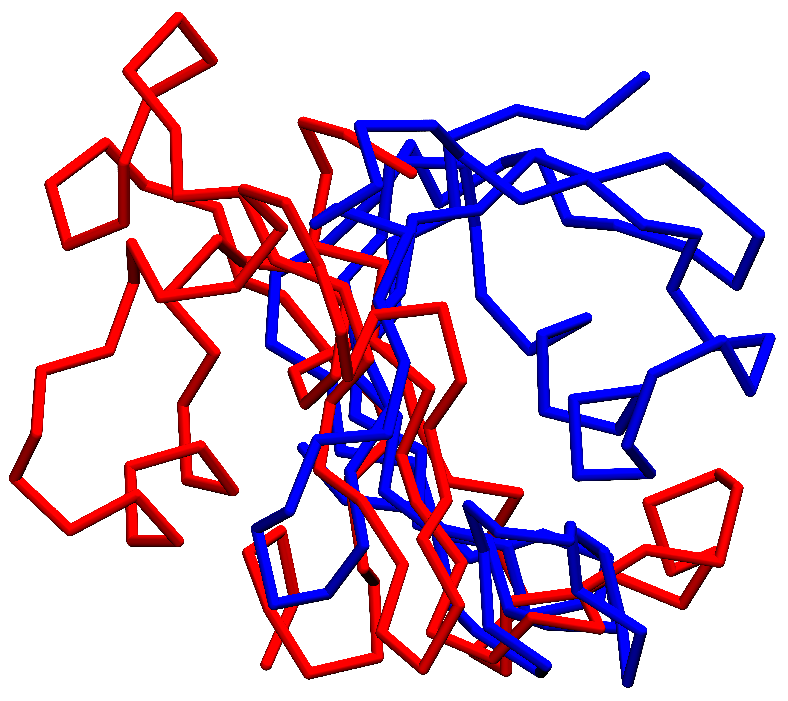

Mirror-image detection (chirality *K* + mirror RMSD)
====================================================

A Cα structure-based (Gō) model can fold a chain into the **global mirror image**
of its native structure. This is a well-known artifact of one-bead-per-residue
models: with only Cα beads and distance-based contacts, the potential is (very
nearly) **blind to handedness**, so the enantiomeric fold sits in an almost
equally deep energy basin. TOPO ships
:mod:`topo.analysis.mirror`, a post-processing analysis that flags mirror frames
frame-by-frame and returns a per-trajectory verdict.

.. important::

   **Why this matters for CG simulations: do not overestimate misfolding.** A
   mirror image preserves almost all native contacts, so the *Q* score
   (:doc:`native_contacts`) reads it as **folded** (:math:`Q \to 1`). Judged on
   *Q* alone the run looks native. But if you inspect the structure by eye — or
   compute an ordinary RMSD that *allows* reflection during alignment — the mirror
   can look badly misfolded, and you may **discard a run that actually folded
   correctly in every way except handedness**, or conversely **accept a mirror as
   native**. Either way the misfolded fraction of an ensemble is estimated wrong.
   *Q* cannot tell the two apart; the metrics here can, and are meant to be
   reported **alongside** *Q*, not instead of it.

The physical picture
--------------------

Fold handedness is a **global chirality**: proteins are built from L-amino acids,
so native folds have a definite handedness (right-handed α-helices, a specific
twist of β-sheets, a specific sign to the way secondary-structure elements pack).
Reflect every coordinate through a plane and you get a structure with **identical
bond lengths, identical contact distances, identical radius of gyration** — but the
opposite handedness. It is a different, non-superimposable molecule (you cannot
rotate a left hand onto a right hand), yet every *distance-based* observable is
unchanged.

That is exactly why a Cα Gō model is prone to it. The forcefield rewards native
**distances**; it has essentially no term that rewards native **handedness**. The
mirror fold satisfies the distance restraints just as well as the native fold, so
during folding the chain can commit to the wrong enantiomer and stay there. The
two analyses below supply the missing handedness information.

Both are **Cα-only, reference-based** metrics, in the same spirit as the *Q*
scorer: each frame is compared against the native reference read from the
all-atom ``pdb_file``.

Metric 1 — mirror-sensitive RMSD
--------------------------------

**Physical meaning.** Fit each frame onto (a) the native reference and (b) an
explicitly **reflected** copy of the native, and ask which it resembles more. A
native-like fold is closer to the native; a mirror fold is closer to the
reflected native.

**Technical meaning — why an ordinary RMSD is not enough.** RMSD is computed after
an optimal superposition. If that superposition is allowed an **improper**
transformation (a rotation *with* a reflection, determinant :math:`-1`), it will
happily reflect a mirror structure onto the native and report a **deceptively
small** RMSD — the reflection is silently absorbed by the fit and the mirror
becomes invisible. Mirror detection therefore requires two things:

1. **A proper-rotation-only Kabsch fit** (determinant fixed to :math:`+1`). Given
   centered frame :math:`X` and target :math:`T`,

   .. math::

      H = X^\top T,\quad U\Sigma V^\top = \mathrm{SVD}(H),\quad
      d = \operatorname{sign}\!\big(\det(UV^\top)\big),\\
      R = U\,\operatorname{diag}(1,1,d)\,V^\top,\qquad X_\mathrm{fit} = X R .

   The :math:`\operatorname{diag}(1,1,d)` correction **forces**
   :math:`\det R = +1`, so the fit can rotate but never reflect. This correction
   is the crux of the whole method — omit it and the test breaks.

2. **An explicitly reflected reference.** Reflection is introduced *only* by
   negating one Cartesian axis of the centered native (a valid
   :math:`\det = -1` improper map), never by the alignment.

The metric then reports, per frame,

.. math::

   \mathrm{RMSD}_\mathrm{native} = \mathrm{RMSD}(X, R_\text{ref}),\qquad
   \mathrm{RMSD}_\mathrm{reflected} = \mathrm{RMSD}(X, R_\text{ref}^\text{refl}),

and their ratio :math:`\mathrm{RMSD}_\mathrm{reflected}/\mathrm{RMSD}_\mathrm{native}`.
A ratio well below 1 means the frame fits the reflected reference much better —
a mirror fold.

Metric 2 — chirality fraction-agreement *K*
-------------------------------------------

**Physical meaning.** Handedness is intrinsically a *local* quantity too: walk
along the chain's secondary-structure scaffold and each turn is either
left-handed or right-handed. *K* measures the fraction of those local turns whose
handedness **agrees with the native structure**. :math:`K \to 1` is fully
native-handed; :math:`K \to 0` is fully inverted (a mirror).

**Technical meaning.** The metric is computed on a coarse **polyline of
secondary-structure segment endpoints** — the start and end Cα of each helix and
strand (length :math:`\ge 4`), flattened and sorted into an ordered point
sequence :math:`P` (this deliberately includes the linker vectors between
segments, so the handedness of the whole SS scaffold is captured). For bond
vectors :math:`v_k = P_{k+1} - P_k`, each window has a **normalized signed triple
product**

.. math::

   \chi_i = \frac{(v_i \times v_{i+1}) \cdot v_{i+2}}
                 {|v_i|\,|v_{i+1}|\,|v_{i+2}|} \in [-1, 1],

a pseudo-scalar that measures local handedness. It has the two properties that
make it the right tool:

* it is **invariant** under proper rotation and translation (it depends only on
  shape, not orientation), and
* it **flips sign** under reflection: :math:`\chi_i(\text{reflect}(P)) = -\chi_i(P)`.

Comparing signs to the native reference gives

.. math::

   K = \frac{1}{M-3}\sum_i \big[\, \operatorname{sign}(\chi_i^\text{frame})
       = \operatorname{sign}(\chi_i^\text{ref}) \,\big] .

*K* is completely orthogonal to *Q*: *Q* counts contacts (unchanged by
reflection), *K* reads handedness (reversed by reflection).

The segment endpoints are taken from TOPO's own **STRIDE** output (the same STRIDE
run used for the H-bond term). Pass a precomputed STRIDE file, or let the tool run
STRIDE on the reference; an explicit ``<label> <start> <end>`` segment file is
also accepted.

The combined per-frame classifier
----------------------------------

The two signals are complementary, so a frame is flagged a **mirror image** only
when all three conditions agree — folded, chirally inverted, and a clearly better
fit to the reflected reference:

.. math::

   \texttt{is\_mirror} \;=\;
   \underbrace{(Q > 0.5)}_{\text{folded}} \;\wedge\;
   \underbrace{(K < 0.3)}_{\text{inverted handedness}} \;\wedge\;
   \underbrace{\left(\tfrac{\mathrm{RMSD}_\mathrm{reflected}}
                          {\mathrm{RMSD}_\mathrm{native}} < 0.9\right)}_{\text{reflected fits better}}

* The ``Q > 0.5`` gate ensures we are discriminating a *wrong-handed collapse*
  from an unfolded coil — an unfolded frame is not a "mirror", just disordered.
* ``K < 0.3`` requires the majority of local turns to disagree with native.
* The RMSD **ratio** (rather than the bare inequality
  :math:`\mathrm{RMSD}_\mathrm{reflected} < \mathrm{RMSD}_\mathrm{native}`)
  requires the reflected fit to be at least ~10 % tighter, so near-tie frames are
  not flagged. All three thresholds are CLI arguments
  (``--q-fold``, ``--k-thresh``, ``--rmsd-ratio``).

Worked example — a mirror from a CG run
---------------------------------------

   **Native vs. a mirror-image fold.** Blue: the native Cα reference. Red: the
   **final conformation** of a coarse-grained folding trajectory (the bundled
   ``test_case``), superimposed on the native by a proper-rotation (no-reflection)
   fit. The two share the same chain topology and nearly the same set of
   contacts, yet pack with **opposite handedness** — the red fold cannot be
   rotated onto the blue one, only reflected onto it.

The mirror metrics turn that visual impression into numbers. For this frame:

.. list-table::
   :header-rows: 1
   :widths: 20 16 64

   * - Metric
     - Value
     - Reading
   * - :math:`Q`
     - ``0.679``
     - **Folded** (:math:`> 0.5`) — the SS-core native contacts (default ``--q-ss-only``) are largely intact, so *Q* alone would call this a folded, native-looking structure. (Whole-molecule *Q* for the same frame is ``0.530`` — still folded.)
   * - :math:`K`
     - ``0.000``
     - **Every** local turn is inverted (:math:`\ll 0.3`) — the handedness is completely opposite to native.
   * - :math:`\mathrm{RMSD}_\mathrm{native}`
     - ``10.93 Å``
     - Proper-rotation fit to the native reference.
   * - :math:`\mathrm{RMSD}_\mathrm{reflected}`
     - ``8.41 Å``
     - Fit to the *reflected* native — **tighter** than to the native itself.
   * - ``RMSD_ratio``
     - ``0.769``
     - :math:`< 0.9`: the reflected reference fits clearly better.
   * - ``is_mirror``
     - ``True``
     - All three conditions met.

This is exactly the failure mode the analysis guards against: judged by *Q*
(0.68) the conformation looks like a folded protein, but :math:`K = 0` and
``RMSD_ratio = 0.77`` show it is a **mirror image** — folded by contacts, wrong by
handedness. Counting it as a genuine (mis)fold would misstate the outcome of the
run.

Per-trajectory verdict
----------------------

``is_mirror`` is emitted **per frame**. The tool also prints a single
per-trajectory verdict taken over the **last** ``--summary-last-frames`` frames
(default **133**):

.. math::

   \texttt{TRAJECTORY\_MIRROR} =
   (\overline{Q}_\text{tail} > 0.5) \wedge
   (\overline{K}_\text{tail} < 0.3) \wedge
   (\overline{\mathrm{RMSD\_ratio}}_\text{tail} < 0.9),

i.e. the **tail means** of each signal thresholded by the same cutoffs.

.. note::

   The window is deliberately taken over a **trailing block of frames**, not the
   whole trajectory: the **early trajectory is typically unfolded**, and judging
   a chain's handedness while it is still a coil would wrongly dilute the verdict.
   Only once the chain has committed to a fold does the mirror question make
   sense.

   The window is specified in **frames, not nanoseconds**, on purpose — the time
   step written into a CG ``.dcd`` is often a placeholder and should not be
   trusted. Choose the window from the number of saved frames you consider
   "converged".

Command-line use
----------------

.. code-block:: bash

   python -m topo.analysis.mirror \
       -r reference.pdb \        # all-atom reference (native Cα + STRIDE source)
       -f traj/traj.dcd \        # CG trajectory to score
       -o mirror.csv \           # combined output CSV
       [-p traj/traj.psf] \      # CG topology (optional; see below)
       [-s stride.dat | --segments seg.txt] \   # SS source (optional)
       [--summary-last-frames 133]

Arguments:

.. list-table::
   :header-rows: 1
   :widths: 24 12 12 52

   * - Flag
     - Type
     - Default
     - Meaning
   * - ``-r``, ``--reference``
     - str
     - *required*
     - **All-atom** reference: native Cα geometry, native contacts (*Q*), and the STRIDE source.
   * - ``-f``, ``--dcd``
     - str
     - *required*
     - CG trajectory to score.
   * - ``-o``, ``--output``
     - str
     - *required*
     - Output CSV path (parent dirs created if needed).
   * - ``-p``, ``--psf``
     - str
     - *optional*
     - CG topology. If omitted, a Cα-only topology is **derived from the reference PDB** and the DCD attached to it — handy when the PSF flavor differs from the reference.
   * - ``-s``, ``--stride``
     - str
     - *optional*
     - Precomputed STRIDE output (``LOC`` records). If neither this nor ``--segments`` is given, STRIDE is **run on the reference**.
   * - ``--segments``
     - str
     - *optional*
     - Explicit ``<label> <start> <end>`` segment file (1-based). Takes precedence over STRIDE.
   * - ``--reflect-axis``
     - x/y/z
     - ``x``
     - Axis negated to build the reflected reference (any axis works).
   * - ``--min-seg-len``
     - int
     - ``4``
     - Minimum SS element length (residues) kept for chirality.
   * - ``-b``, ``--start-frame``
     - int
     - ``0``
     - First frame (inclusive; negative indexing supported).
   * - ``-e``, ``--end-frame``
     - int
     - ``-1``
     - Last frame (exclusive; ``-1`` = last frame).
   * - ``--cutoff`` / ``--local-separation`` / ``--tolerance``
     - —
     - ``4.5`` / ``3`` / ``1.2``
     - Native-contact definition for *Q* (identical to :doc:`native_contacts`).
   * - ``--q-ss-only``
     - bool
     - ``True``
     - Restrict *Q* to native contacts whose **both** residues lie in a secondary-structure element (the same helices/strands used for *K*). This is the **default**; pass ``--q-ss-only False`` (or ``0``) to score *Q* over the whole molecule instead.
   * - ``--q-fold`` / ``--k-thresh`` / ``--rmsd-ratio``
     - float
     - ``0.5`` / ``0.3`` / ``0.9``
     - Classifier thresholds for ``is_mirror`` and the trajectory verdict.
   * - ``--summary-last-frames``
     - int
     - ``133``
     - Trailing frames over which the per-trajectory verdict is taken.

.. important::

   By default *Q* here is **restricted to secondary-structure elements**: only
   native contacts whose **both** residues lie in a STRIDE helix/strand (the same
   elements that define *K*) are counted. This focuses *Q* on the folded SS core —
   exactly the part of the chain whose handedness the mirror question is about — and
   makes the ``is_mirror`` gate report on the packed scaffold rather than on
   flexible loops. Pass ``--q-ss-only False`` to recover the **whole-molecule**
   definition (every heavy-atom contact with :math:`|i-j| >` ``local-separation``),
   as in :doc:`native_contacts`. The two definitions give different absolute *Q*
   values; the chirality *K* and the RMSD ratio are unaffected either way.

Output CSV
----------

One row per scored frame:

.. code-block:: text

   Frame,Q,K,RMSD_native,RMSD_reflected,RMSD_ratio,is_mirror
   0,0.120,0.364,22.287,22.582,1.013,False
   ...
   26665,0.694,0.091,11.98,5.34,0.446,True

* ``Frame`` — 0-based frame index (respects ``--start-frame``).
* ``Q`` — fraction of native contacts (secondary-structure elements only by
  default; whole protein with ``--q-ss-only False``).
* ``K`` — chirality fraction-agreement (:math:`\to 1` native-handed, :math:`\to 0` mirror).
* ``RMSD_native`` / ``RMSD_reflected`` — Å, proper-rotation fit to the native /
  reflected reference.
* ``RMSD_ratio`` — ``RMSD_reflected / RMSD_native`` (lower = more mirror-like).
* ``is_mirror`` — per-frame boolean from the combined rule above.

The console also prints the whole-run mirror-frame fraction and the trailing-window
verdict.

Python API
----------

The metrics are importable for custom analysis:

.. code-block:: python

   import numpy as np
   from topo.analysis import (
       mirror_rmsd, local_chirality, chirality_agreement,
       segment_endpoints_from_stride, classify_mirror,
   )
   from topo.analysis.mirror import build_cg_universe
   from topo.utils.external import run_stride
   from topo.analysis import reference_residue_geometry
   from topo.analysis.native_contacts import load_universe
   from topo.utils.nonbonded import get_residue_mapping

   # Native Cα + SS endpoints from the reference
   u_ref = load_universe("reference.pdb")
   ca_native, _ = reference_residue_geometry(u_ref)
   key_to_index, _, _ = get_residue_mapping(u_ref)
   endpoints = segment_endpoints_from_stride(run_stride("reference.pdb"), key_to_index)
   chi_ref = local_chirality(ca_native[endpoints])

   # Score a CG trajectory
   u_cg = build_cg_universe("reference.pdb", "traj/traj.dcd")   # psf optional
   for ts in u_cg.trajectory:
       pos = u_cg.atoms.positions
       rn, rr = mirror_rmsd(pos, ca_native)
       K = chirality_agreement(local_chirality(pos[endpoints]), chi_ref)[0]
       # ... collect rn, rr, K, Q, then classify_mirror(Q, K, rn, rr)

Key functions: :func:`~topo.analysis.mirror.kabsch_proper` (det = +1 fit),
:func:`~topo.analysis.mirror.mirror_rmsd`,
:func:`~topo.analysis.mirror.local_chirality`,
:func:`~topo.analysis.mirror.chirality_agreement`,
:func:`~topo.analysis.mirror.segment_endpoints_from_stride`,
:func:`~topo.analysis.mirror.classify_mirror`.

Typical workflow
----------------

1. **Run a folding simulation** and score its native-contact *Q*
   (:doc:`native_contacts`). If *Q* climbs toward 1 the run "looks folded".
2. **Check handedness** before trusting that::

      python -m topo.analysis.mirror -r reference.pdb -f traj/traj.dcd -o mirror.csv

3. **Interpret.** A genuinely native run has :math:`K \to 1` and
   :math:`\mathrm{RMSD}_\mathrm{native} < \mathrm{RMSD}_\mathrm{reflected}`
   (``is_mirror = False``). A mirror run has high *Q* but :math:`K \to 0`,
   ``RMSD_ratio < 0.9``, and ``TRAJECTORY_MIRROR = True`` — folded by contacts,
   wrong by handedness.
4. **Use the verdict to clean your statistics.** When estimating a folded/misfolded
   fraction over an ensemble, exclude or separately account for mirror trajectories
   so that (a) mirror artifacts are not counted as native successes, and (b)
   otherwise-correct folds are not counted as gross misfolds by a
   reflection-allowing RMSD.
