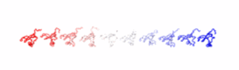
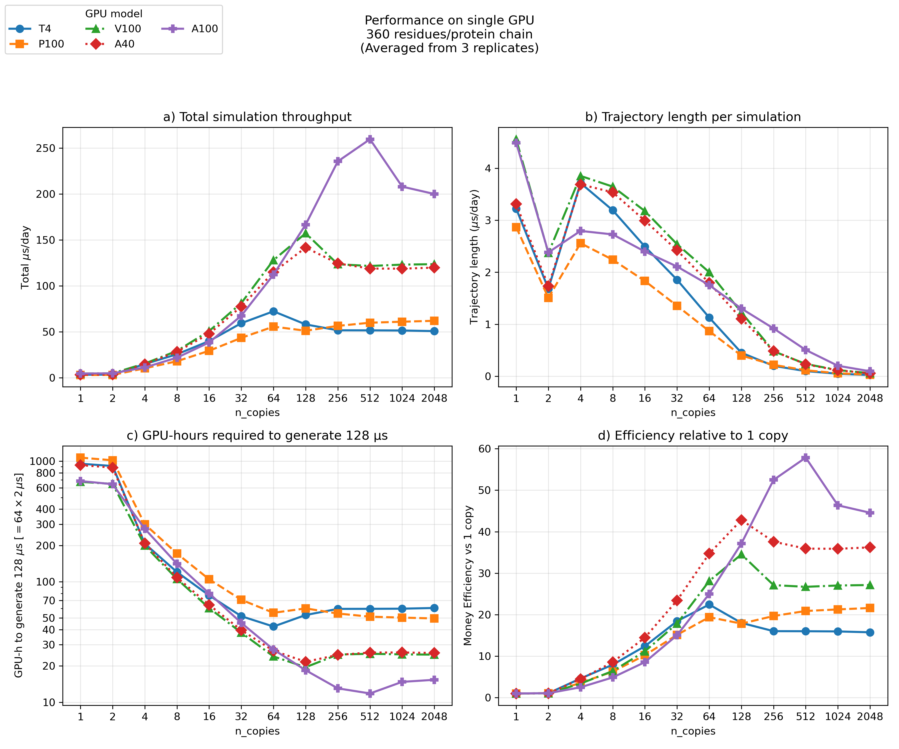

# Tutorial 4 — Many copies in one run (better GPU utilization)

**Goal:** run **many non-interacting copies** of a single chain in one simulation,
so a GPU (which is wasted on one ~100-bead chain) stays busy and you collect
**N independent trajectories per run** for better sampling. Then split the
multi-chain trajectory back into per-chain DCDs for normal analysis.

**Time:** the 10-copy demo finishes in a few seconds on a CPU; the real win is on
a GPU.

**Prerequisite:** [Tutorial 1](01_single_domain.md).



***The run** — every copy evolves independently, giving 10 trajectories per run to split apart for analysis.*

> Regenerate after your run with
> `python ../_viz/render_cg.py --psf traj/traj_multi.psf --dcd traj/traj.dcd --out img --hero last --no-align --color chain`.

---

## Why do this?

A coarse-grained protein is tiny — `P0CX28` is 106 CA beads. A modern GPU can
integrate tens of thousands of particles per step at almost the same wall-clock
cost as a few hundred, so simulating **one** small chain leaves the device almost
idle. Packing `n_copies` independent chains into a single `System` fills the GPU
and turns one run into `n_copies` trajectories — exactly what you want when a
study needs many trajectories for statistics (folding rates, free-energy
estimates, etc.).

The copies must be **truly independent** (no chain should feel another). This is
guaranteed two ways:

- bonded terms (bonds/angles/torsions) and constraints are duplicated **within**
  each copy with offset atom indices, and
- every `CustomNonbondedForce` (the Yukawa electrostatics and the structure-based
  contacts) is restricted to **intra-copy** interactions via OpenMM
  `addInteractionGroup(group_k, group_k)`.

A direct check confirms the potential is separable: evaluated on the freshly
replicated starting configuration — where every copy is an identical translate of
the single chain — the total potential energy equals exactly `N ×` the
single-chain energy. This is a property of the *initial* state that verifies no
inter-copy term leaked in; it is not a conserved identity. Once the run starts,
each copy receives independent Langevin forces and diverges, so at later times the
total energy is no longer `N ×` any single chain's energy — only the strict
independence of the copies is preserved.

## Files in this folder

| File | Role |
|------|------|
| `P0CX28_clean.pdb` | Single-chain input structure (106 residues). |
| `domain.yaml` | Calibrated single-domain nscale (2.5044), as in Tutorial 1 (syntax: [Domain definition file](../usage/domain_definition.rst)). |
| `md.ini` | Config; note the **`n_copies`** and `copy_shift` options. |
| `run_simulation.py` | Optional one-line shim to `topo.mdrun` (prefer `topo-mdrun -f md.ini`); the shared runner replicates automatically when `n_copies > 1`. |
| `split_chains.py` | Optional shim around `topo.split_chains` (prefer `python -m topo.utils.multichain`); splits the multi-chain DCD into per-chain DCDs. |

## How it works in the run script

Multi-copy support is controlled entirely by `n_copies` (default `1`).
`run_simulation.py` is a thin shim to the packaged runner `topo.mdrun`; the
replication itself lives in the shared build step `topo.engine.build_system`,
which adds one conditional right after building the single-chain model:

```python
cgModel = topo.models.buildCoarseGrainModel(cfg.pdb_file, **cfg.build_kwargs())

if cfg.n_copies > 1:
    system, topology, positions = topo.make_noninteracting_copies(
        cgModel.system, cgModel.topology, cgModel.positions,
        n_copies=cfg.n_copies, shift=cfg.copy_shift * unit.nanometer)
else:
    system, topology, positions = cgModel.system, cgModel.topology, cgModel.positions
# ... everything below runs on (system, topology, positions) unchanged ...
```

So Tutorials 1–3 and this one use the **same** runner (`topo.mdrun`); only
`n_copies` in `md.ini` differs.

`make_noninteracting_copies` is the package primitive that takes the single-chain
model and returns the replicated `(system, topology, positions)`. It wraps
`replicate_system_intra_only`, `replicate_topology` and `replicate_positions`
(all on `topo`). Copy *k* is the contiguous atom block `[k*n : (k+1)*n]`.

## Step-by-step

### 1. Set `n_copies` in `md.ini`
```ini
n_copies = 10          ; independent chains in one run
copy_shift = 5.0       ; nm, x-offset between copies at the start
device = CPU           ; <-- set to GPU on a CUDA machine; that's the point
```

### 2. Run
```bash
topo-mdrun -f md.ini                     # or: python -m topo.mdrun -f md.ini
```
The **same** standard runner is used as in Tutorials 1–3; because `n_copies = 10`
its `if cfg.n_copies > 1` branch replicates the model via
`topo.make_noninteracting_copies`. Output goes to the `traj/` run folder (DCD +
PSF only, no PDB): `traj/traj.dcd` (all chains), `traj/traj.log`, `traj/traj.chk`,
`traj/traj.psf` (single-chain topology) and `traj/traj_multi.psf`
(multi-chain topology, matches the combined DCD).

> The in-folder `run_simulation.py` is just a one-line shim
> (`from topo.mdrun import mdrun; mdrun()`) kept so the tutorial is
> self-contained; `python run_simulation.py -f md.ini` is exactly equivalent.

### 3. Split into per-chain trajectories
```bash
python -m topo.utils.multichain -f traj/traj.dcd -tp traj/traj.psf -o traj --outname traj
```
This writes `traj/traj_{0..9}.dcd` — one ordinary single-chain trajectory per
copy (each recentred per frame; pass `--no-center` to keep raw coordinates). It
streams the combined DCD in chunks so it scales to trajectories too large to fit
in memory. Passing the single-chain PSF with `-tp` infers `n_copies` from the
DCD's atom count (or give `-n 10` explicitly). The in-folder `split_chains.py` is
a thin wrapper around the same routine (`topo.split_chains`) that reads paths from
`md.ini`. Load each split trajectory with the single-chain PSF:
```python
import MDAnalysis as mda
u = mda.Universe("traj/traj.psf", "traj/traj_0.dcd")
# RMSD, Q, Rg, ... per independent trajectory
```

## Notes & tips

- **Pick `n_copies` for your GPU.** Start with 10–50 small chains and increase
  until the per-step time stops being flat (you've saturated the device). Memory
  is the eventual limit.
- **Independent sampling.** Each copy gets different random Langevin forces, so
  the `n_copies` trajectories are independent samples of the same ensemble —
  ideal for averaging observables and estimating error bars.
- **`copy_shift`** only sets the starting separation; since the chains never
  interact, its exact value does not affect the physics (it keeps the initial
  structure tidy and easy to view).
- **No PBC here.** With `pbc = no` the chains simply occupy different regions of
  space. If you enable PBC, make the box large enough to hold all shifted copies.

## Performance benchmark

The plot below quantifies exactly this trade-off on a realistic chain — a
360-residue protein — swept over `n_copies` from 1 to 2048 on five GPUs
(T4, P100, V100, A40, A100), each point averaged over three replicates.



- **(a) Total throughput** — aggregate µs/day summed over all copies — climbs
  steeply as copies fill the device, then saturates once the GPU becomes
  compute-bound. Both the height of the plateau and how many copies it takes to
  reach it are set by the card: the A100 keeps scaling to ~260 µs/day near 512
  copies, the V100/A40 level off around 120–155 µs/day, and the older T4/P100
  saturate near 50–70 µs/day by ~64 copies.
- **(b) Per-chain rate** — µs/day advanced by any *single* copy — falls
  monotonically as the fixed GPU is shared across more chains. This is the price
  of aggregate throughput: each individual trajectory progresses more slowly in
  wall-clock time.
- **(c) GPU-hours for a fixed amount of sampling** (here 128 µs) is the practical
  figure of merit. It drops by more than an order of magnitude from 1 copy to the
  sweet spot, bottoming out around 128–512 copies before flattening — that
  minimum is the most cost-effective `n_copies` for each card.
- **(d) Efficiency vs 1 copy** — throughput per copy normalized to the
  single-copy run — makes the win explicit: up to ~35–58× more sampling per
  GPU-hour on data-center cards at their optimum.

**Reading it for your own runs:** pick `n_copies` near the knee of panel (c)/(d)
for your GPU. Newer, larger cards (A100) keep scaling to several hundred copies;
older or smaller ones (T4, P100) saturate by a few dozen, so pushing past that
buys little. Beyond the optimum, the per-copy rate (b) keeps dropping while total
throughput (a) is already flat — very large `n_copies` just slows each individual
trajectory for no aggregate gain (and eventually runs into GPU memory limits).

## Try next
- Switch `device = GPU` and compare ns/day for `n_copies = 1` vs `50` — the
  per-copy cost drops sharply once the GPU is filled.
- Apply the same pattern to the multidomain system from Tutorial 2.
