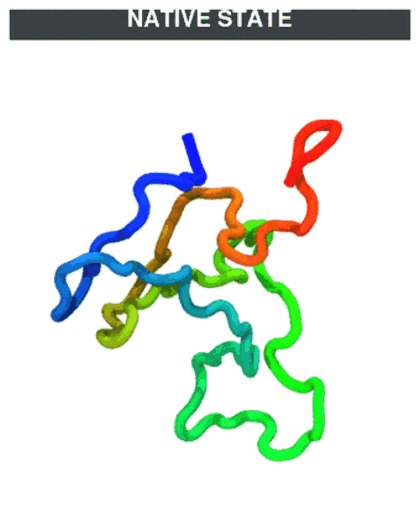

# Tutorial 6 — Temperature annealing & quenching

**Goal:** drive a simulation through a **temperature protocol** instead of a
single constant temperature — hold the protein hot enough to unfold, then bring
it back down to `ref_t` to watch it **refold**. You will learn both supported
protocols (a delta **T-jump quench** and a **linear cooling ramp**), every config
key that controls them, how the run splits into **two phases writing two separate
trajectories**, and how the schedule interacts with restarts.

**Time:** two short runs, ~2–3 seconds each.

**Prerequisite:** do [Tutorial 1](01_single_domain.md)
first — this reuses the same single-domain protein (`P0CX28`) and its calibrated
`domain.yaml`.



***Temperature protocol (unfold → refold).** The quench phase at 600 K unfolds the chain (native contacts break), then the T-jump back to 300 K lets it refold. CA trace coloured N→C (blue→red).*

---

## The idea: a temperature *protocol* in two phases

An ordinary run (Tutorials 1–4) is **equilibrium**: one Langevin thermostat held
at `ref_t` for all `md_steps`. Annealing (`anneal = yes`) splits the run into
**two phases**, each writing its **own** trajectory and log:

| Phase | What it does | Steps | Output files |
|-------|--------------|-------|--------------|
| **Quench** | Hold at `t_high` (and, for a linear ramp, cool down to `ref_t`). The protein unfolds here. | `anneal_steps` (+ `anneal_ramp_steps` for linear) | `<outname>_quench.dcd`, `<outname>_quench.log` |
| **Production** | Run at `ref_t`. The protein refolds and you collect the equilibrium ensemble. | `md_steps` | `<outname>.dcd`, `<outname>.log` |

Two consequences worth internalizing:

- **`anneal_steps` is *separate* from `md_steps`.** The grand total is
  `quench_steps + md_steps` (where `quench_steps = anneal_steps` for a jump, or
  `anneal_steps + anneal_ramp_steps` for a linear ramp). `md_steps` is now
  *only* the production length.
- **The hot part never contaminates your production trajectory.** Because the
  quench writes `_quench.*` and production writes the normal `.*`, your
  `traj.dcd` contains only the `ref_t` ensemble — exactly what you want for
  analysis. `ref_t` is always the low / refold temperature; there is **no
  separate `t_low` key**.

The quench is treated as a **one-time preparation step**: it writes **no
checkpoint**, and the step/time clock is **reset to zero** when production
begins, so the production run looks exactly like an ordinary standalone run
(its `Step` column starts at 0). Positions and velocities carry over, so a
`jump` is simply the hot structure suddenly thermostatted at `ref_t`. The single
checkpoint `<outname>.chk` therefore holds **only production state**, which keeps
restarts clean (see below).

When the run starts, the runner prints both phases:

```
Temperature protocol [quench -> _quench.*]: 600 K x 3000
Temperature protocol [production -> .*]:    300 K x 3000  (grand total 6000 steps)
```

## Two ways down: jump vs. linear

`anneal_ramp` selects how the temperature goes from `t_high` to `ref_t`:

| `anneal_ramp` | What happens | Use it for |
|---------------|--------------|------------|
| `jump` (default) | The quench phase is purely the hold at `t_high`; the thermostat then drops to `ref_t` **instantaneously** at the phase boundary (a delta T-jump that lands exactly between the `_quench` and production files). Folding happens at a single, well-defined temperature. | **Folding kinetics / mechanism.** Clean folding times and pathways because rates aren't convolved with a changing T. Mirrors an experimental T-jump. |
| `linear` | The quench phase holds at `t_high`, then **cools gradually** to `ref_t` over `anneal_ramp_steps` in `anneal_ramp_increments` discrete steps. Production then runs at `ref_t`. | **Refolding yield / structure recovery.** Slow cooling avoids kinetic traps (classic simulated annealing toward the native minimum). *Not* for clean kinetics — cooling and folding overlap. |

**Recommendation:** for studying how (and how fast) the protein refolds, use the
**delta `jump`**. Reach for `linear` only when the goal is "recover the native
state at all," not "measure the folding rate."

## All annealing options

All keys live in the same flat `md.ini`, alongside the usual settings.
They are read **only when `anneal = yes`**.

| Option | Type | Default | Description |
|--------|------|---------|-------------|
| `anneal` | bool | `no` | Turn the annealing protocol on. `no` → ordinary constant-`ref_t` equilibrium (one phase, one file set). |
| `t_high` | float [K] | — (**required** when `anneal = yes`) | High / unfolding temperature held during the quench phase. |
| `anneal_steps` | int (`> 0`) | `0` | Quench-phase steps held at `t_high`. **Separate from `md_steps`.** Must be many thermal relaxation times (`~1/tau_t`) and long enough to unfold. |
| `anneal_ramp` | str | `jump` | `jump` (instantaneous drop to `ref_t` at the phase boundary) or `linear` (gradual cool-down inside the quench phase). |
| `anneal_ramp_steps` | int | `0` | **`linear` only.** Quench-phase steps spent ramping `t_high → ref_t` (added on top of `anneal_steps`). |
| `anneal_ramp_increments` | int | `20` | **`linear` only.** Number of discrete temperature steps in the ramp; the last increment lands exactly on `ref_t`. |

Reused, not new: `ref_t` (the low temperature), `tau_t` (thermostat coupling),
`md_steps` (now the **production** length only), `nstxout` / `nstlog` / `nstchk`
(apply to both phases' files).

**Grand total** of integration steps:

```
total = anneal_steps + (anneal_ramp_steps if linear else 0) + md_steps
        \_________________ quench phase ________________/   \ production /
```

## ⚠️ The most important physical knob: hold length vs. thermostat coupling

A Langevin thermostat doesn't change the temperature instantly even on a `jump`:
the kinetic energy relaxes toward the new setpoint over roughly **`1 / tau_t`**.
So the *setpoint* jumps, but the *system* takes ~`1/tau_t` to follow.

That has two consequences you must respect:

1. **`anneal_steps` must be ≫ the relaxation time** (`1/tau_t`, converted to
   steps via `dt`), or the system never actually reaches `t_high` and won't
   fully unfold.
2. **The hold must be long enough to lose native memory** — verify the protein
   genuinely unfolds during the quench (fraction of native contacts *Q* → 0,
   `Rg` plateaus, in `traj_quench.dcd`). Otherwise refolding is biased by
   leftover native structure.

> **These tutorial configs cheat for speed:** they use `tau_t = 1.0` ps⁻¹
> (relaxation ≈ 1 ps ≈ 67 steps at `dt = 0.015`), so a 3000-step hold easily
> reaches 600 K. **Production runs typically use `tau_t ≈ 0.05` ps⁻¹**
> (relaxation ≈ 20 ps), so you would need an `anneal_steps` of *many* ×
> 20 ps — e.g. a 3 ns hold — for the same effect. Scale the hold with your
> friction, not with the demo numbers.

## Files in this folder

| File | Role |
|------|------|
| `P0CX28_clean.pdb` | Input structure (same single domain as Tutorial 1). |
| `domain.yaml` | Calibrated contact `nscale` — folded at 300 K, unfolds at 600 K (syntax: [Domain definition file](../usage/domain_definition.rst)). |
| `md.ini` | **Delta T-jump quench** (`anneal_ramp = jump`). |
| `md_linear.ini` | **Linear cooling ramp** (`anneal_ramp = linear`). |
| `run_simulation.py` | The runner shim (`= python -m topo.mdrun`). |

## Step-by-step

### 1. Run the delta T-jump quench

Use either the installed console command / module, or the in-folder shim — they
are identical (`topo-mdrun` handles annealing when `anneal = yes`):
```bash
topo-mdrun -f md.ini                  # == python -m topo.mdrun -f md.ini
python run_simulation.py -f md.ini    # equivalent in-folder shim
```
The console echoes both phases and the grand total:
```
Temperature protocol [quench -> _quench.*]: 600 K x 3000
Temperature protocol [production -> .*]:    300 K x 3000  (grand total 6000 steps)
```
Outputs land in `traj_jump/` and you get **two** trajectories/logs:
`traj_quench.dcd` / `traj_quench.log` (the 600 K hold) and `traj.dcd` /
`traj.log` (the 300 K production), plus one shared `traj.chk`.

Check that each file holds the temperature you expect:
```python
import numpy as np
from topo.reporter.topo_reporter import readOpenMMReporterFile
q = readOpenMMReporterFile("traj_jump/traj_quench.log")
p = readOpenMMReporterFile("traj_jump/traj.log")
print("quench     mean T:", round(np.array(q["Temperature (K)"]).mean()))   # ~600 K
print("production mean T:", round(np.array(p["Temperature (K)"]).mean()))   # ~300 K
print("production steps :", int(np.array(p["Step"]).min()), "..",
                            int(np.array(p["Step"]).max()))                 # 100 .. 3000 (reset to 0)
```
(Instantaneous CG temperatures are noisy for a small chain — judge the *mean* of
each file, not single frames.)

### 2. Run the linear cooling ramp
```bash
topo-mdrun -f md_linear.ini                  # == python -m topo.mdrun -f md_linear.ini
python run_simulation.py -f md_linear.ini    # equivalent in-folder shim
```
Now the **quench** schedule has a staircase of cooling stages (outputs in
`traj_linear/`); production is still a flat `ref_t` run:
```
Temperature protocol [quench -> _quench.*]: 600 K x 1500 -> 570 K x 300 -> ... -> 300 K x 300
Temperature protocol [production -> .*]:    300 K x 3000  (grand total 7500 steps)
```
Plot `Temperature (K)` vs `Step` from `traj_linear/traj_quench.log` and you'll
see the staircase descend from 600 K to 300 K; `traj_linear/traj.log` then sits
flat at 300 K.

### 3. (Optional) Confirm unfolding/refolding
For a real study you'd track the fraction of native contacts *Q* with
`topo.analysis` (see Tutorial 5's machinery): *Q* should fall toward 0 across
`traj_quench.dcd` (the hot hold) and climb back toward 1 across `traj.dcd` (the
`ref_t` production). With the tiny demo step counts here this is only
illustrative — increase `anneal_steps` and `md_steps` for a meaningful curve.

## Annealing + restart

Restart (Tutorial 3) applies to the **production phase only** — the quench is a
short, one-time preparation that is never restarted. Because the checkpoint holds
production state and the production clock starts at 0, a restart behaves exactly
like restarting a normal run:

- `restart = yes` **skips the quench entirely** and resumes production from
  `<outname>.chk`, appending to the production `.dcd` / `.log`. The `_quench.*`
  files from the original run are left untouched.
- `md_steps` is the **production total**; the runner runs `md_steps − steps_done`
  more production steps. To extend production, raise `md_steps`.

Keep `output_dir` / `outname` / the protocol keys identical between stages. (If a
run is killed *during* the quench, no checkpoint exists yet, so `restart = yes`
simply falls back to a fresh run and redoes the short quench — which is what you
want.)

## Key takeaways

- Annealing is a **two-phase** protocol: a **quench** (`_quench.*`) then
  **production** (`.*`). Same runner, selected by `anneal`.
- **`anneal_steps` is separate from `md_steps`**; the grand total is their sum
  (plus the linear ramp). `md_steps` is production-only.
- **Two trajectories** keep the hot hold out of your production ensemble.
- **Production resets to step 0** and owns the only checkpoint, so restarting an
  annealed run is identical to restarting a normal run — the quench is never
  redone.
- **`ref_t` is the low temperature** — reused directly, no `t_high`/`t_low`
  bookkeeping.
- **`jump` for kinetics, `linear` for yield.**
- **Match `anneal_steps` to your `tau_t`** — the hold must be many thermal
  relaxation times, and long enough to actually unfold.

## Try next

- Sweep `t_high` (e.g. 500/600/700 K) and check at which temperature the quench
  actually unfolds the protein (*Q* → 0 in `traj_quench.dcd`).
- Switch the demo to production-like coupling (`tau_t = 0.05`) and lengthen
  `anneal_steps` accordingly to see the realistic relaxation timescale.
- Generate many independent refolding trajectories at once by combining this
  protocol with **multi-copy** runs (Tutorial 4): set `n_copies > 1` to launch a
  batch of quenches in a single GPU job.
