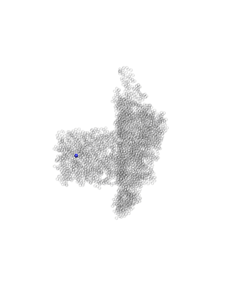

# Tutorial 8 — Co-translational synthesis on a coarse-grained ribosome

**Goal:** synthesize a protein **residue by residue on TOPO's own coarse-grained
ribosome**, using codon-resolved kinetics with `topo-csp`. This is the
ribosome-based counterpart to [Tutorial 7](07_translation_cylinder.md),
which replaces the physical ribosome with an analytic cylindrical tunnel.

Unlike the CHARMM-based O'Brien reference, everything here is **standalone
TOPO**: the ribosome is a truncated CG bead model (`ribosome_trunc.pdb`, loaded
by `topo.csp.ribosome.load_ribosome`) — no external `.cor`/`.psf`/`.prm` files.
The nascent chain grows N→C through the exit region and is ejected once
complete.



***Synthesis on the ribosome** — the chain (coloured beads) grows through TOPO's coarse-grained ribosome (translucent grey); already-emerged N-terminal residues fold while the C-terminus is still being added inside.*

> The GIF is for the `4c5c/` system. After a run, stitch the per-length frames into one
> movie and render it (beads + the translucent ribosome as context):
> ```bash
> topo-csp-movie -o synth_out                    # -> synth_out/movie.{psf,dcd}
> python ../_viz/ribosome_scenery_tcl.py -p ribosome_trunc.pdb -o synth_out/ribo.tcl
> python ../_viz/render_cg.py --psf synth_out/movie.psf --dcd synth_out/movie.dcd \
>        --out img --hero last --no-align --rep beads --fit-main-only \
>        --select "name CA and x < 9000" --selupdate --extra-tcl synth_out/ribo.tcl
> ```
> (the growing chain parks not-yet-synthesized beads at a far sentinel, which
> `--select … --selupdate` hides.)

**Prerequisite:** the coarse-grained model of
[Tutorial 1](01_single_domain.md) and
the domain-scaling idea of
[Tutorial 2](02_multidomain.md).

## Two worked systems

| System | Residues | Notes |
|--------|----------|-------|
| `4c5c/` | 306, multidomain | Full-length synthesis `L = 1 → 306`, then ejection. The main validation case. |
| `P0CX28/` | 106, single-domain | The single-domain protein from Tutorial 1, `L = 1 → 106`, `nscale = 2.5044`. |

## Files (per system)

| File | Role |
|------|------|
| `*_clean.pdb` | Target folded structure (defines the native contacts). |
| `*_stride.dat` | Precomputed STRIDE backbone hydrogen bonds. |
| `domain.yaml` | Domain definition / contact `nscale` (see [Domain definition file](../usage/domain_definition.rst)). |
| `*_mrna.txt` | The mRNA codon sequence that times each residue. |
| `trans_times.txt` | Per-codon translation times (kinetics input). |
| `ribosome_trunc.pdb` | TOPO's coarse-grained truncated ribosome. |
| `csp_val.ini` | Full-length run config (`L0=1 → L_max`, `AllBonds`, equilibrium-PTC, ejection). |
| `csp_debug.ini` | Short clamped debug profile (4c5c only). |
| `analyze_standalone.py` | Post-run validation report. |

## Run it

From a system folder (e.g. `4c5c/`):

```bash
topo-csp -f csp_val.ini        # -> synth_out/
```

The runner uses **codon-resolved kinetics** (each elongation cycle split into
three kinetic sub-stages) with a per-stage **dt-halving stability guard**, rigid
`AllBonds` (the default), and **always-on equilibrium-PTC seeding** — each new
residue is placed one peptide bond from the previous C-terminus, clear of the
ribosome, so rigid bonds seed cleanly. A successful full-length run shows **no
`[stability]` lines** in the log.

## What it produces

- `synth_out/L_001/ … L_<L_max>/` — one folder per chain length, each with the
  MD trajectory and the nascent structure at that length.
- `synth_out/ejection/` — the post-synthesis release: `traj_final.pdb`, the
  built-once native-contact PDB, and run metadata.

## Validating the run

```bash
python analyze_standalone.py
```

It checks that per-stage potential energy stays finite (no blow-ups) and that
the ejected chain diffuses cleanly out of the tunnel without penetrating the
ribosome. Its **quantitative cross-check against the O'Brien reference** relies
on the reference run from the retired CSP-development tutorials (12/13/15), which
now live under `sandbox/retired_translation_tutorials/`; the energy-stability and
ejection checks are self-contained and do not need them.
