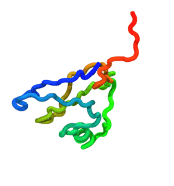

# Tutorial A.3 — Restarting a run & understanding the outputs

**Goal:** learn how to (a) **continue** a simulation from a checkpoint — essential
for long production runs that exceed a wall-clock limit or get interrupted — and
(b) understand every file TOPO writes.

**Time:** two short runs, ~2 seconds each.

**Prerequisite:** do [Tutorial A.1](A1_single_domain.md) first. This
tutorial reuses the same single-domain protein (`P0CX28`).



***The run** — stage 1 (0→5 000 steps) **continued** from the checkpoint to 10 000 steps: one unbroken trajectory.*

---

## Files in this folder

| File | Role |
|------|------|
| `P0CX28_clean.pdb` | Input structure. |
| `md.ini` | **Stage 1**: the initial run (`restart = no`, `md_steps = 5000`). |
| `md_restart.ini` | **Stage 2**: continue from the checkpoint (`restart = yes`, `md_steps = 10000`). |
| `run_simulation.py` | The runner script; a thin shim to `topo.mdrun` (so `topo-mdrun -f md.ini` is equivalent). |

## How restarting works

TOPO writes a **checkpoint** file (`traj/traj.chk`) every `nstchk` steps
(`nstchk` defaults to `nstxout` if unset). A checkpoint stores the full dynamical
state — **positions and velocities** — so a restarted run picks up exactly where
it left off (not just the coordinates).

Two settings control a restart:

- `restart = yes` — load the checkpoint instead of the PDB's coordinates, and
  skip minimization.
- `md_steps` — the **TOTAL** target step count, *not* the number of extra steps.
  The runner computes `remaining = md_steps - steps_already_done` and runs only
  that many. So to add 5000 steps on top of an initial 5000, set `md_steps = 10000`.

Everything else (`output_dir`, `outname`, `pdb_file`) must stay **identical**
between stages so the restart targets the same files. On restart, the reporters
**append** to the existing `.log` and `.dcd`, giving you one continuous record.

## Step-by-step

### 1. Stage 1 — initial run

Use either the installed console command / module, or the in-folder shim — they
are identical:
```bash
topo-mdrun -f md.ini                  # == python -m topo.mdrun -f md.ini
python run_simulation.py -f md.ini    # equivalent in-folder shim
```
This produces `traj/traj.chk`, `traj/traj.log`, `traj/traj.dcd`, etc., and runs
to step 5000. Check the last log line:
```bash
tail -1 traj/traj.log     # step column should read 5000
```

### 2. Stage 2 — continue from the checkpoint
```bash
topo-mdrun -f md_restart.ini                  # == python -m topo.mdrun -f md_restart.ini
python run_simulation.py -f md_restart.ini    # equivalent in-folder shim
```
Watch the console: it prints
`Restart simulation from step: 5000` and then runs 5000 more steps to reach
10000. Confirm the log now continues past 5000:
```bash
tail -3 traj/traj.log     # you should now see step 10000 at the end
```
The `.dcd` trajectory has likewise grown — it was appended to, not overwritten.

> If you re-run stage 2 again, it will see `steps_done = 10000`, compute
> `remaining = 0`, and do nothing — exactly what you want for an idempotent
> "make sure it reached 10000 steps" workflow.

## The output files, in full

| File | Format | Purpose | When to use |
|------|--------|---------|-------------|
| `traj/traj.log` | text (fixed-width) | Step, time, energies, temperature, speed. | Quick health check, plotting energy vs time. |
| `traj/traj.dcd` | binary | Trajectory: coordinates every `nstxout` steps. | Visualization (VMD), analysis (MDAnalysis, MDTraj). |
| `traj/traj.chk` | binary | Checkpoint: positions **+ velocities**, every `nstchk` steps. | Restarting (this tutorial). |
| `traj/traj.psf` | text | CA-model topology (atoms, bonds). | Loading the `.dcd` in analysis tools that need a topology. |
| `traj/traj_final.pdb` | text | Last conformation (CA PDB). | Seed a follow-up run via `init_position`. |
| `traj/traj_runinfo.log` | text | Run provenance: package versions, hardware, GPU, timing. | Reproducibility; debugging performance differences. |
| `P0CX28_clean_stride.dat` | text | Cached STRIDE hydrogen-bond output (next to the input PDB). | Reused automatically; delete to force regeneration. |

### Loading the trajectory for analysis
```python
import MDAnalysis as mda
u = mda.Universe("traj/traj.psf", "traj/traj.dcd")
print(u.atoms.n_atoms, "CA beads,", len(u.trajectory), "frames")
# e.g. compute RMSD to the initial frame, radius of gyration, etc.
```

## Key takeaways

- **Checkpoint = positions + velocities**, so the run continues without a break in the record.
- **`md_steps` is a total, not an increment.**
- **Logs and trajectories append** on restart, so long runs stay in one file set.
- Keep `output_dir` / `outname` / `pdb_file` consistent across stages.

## Try next

- Split a longer run into 3+ stages (`md_steps = 15000`, `20000`, …) to mimic a
  cluster job that resubmits itself until it reaches the target length.
- Apply the same restart pattern to the multidomain run from Tutorial A.2.
