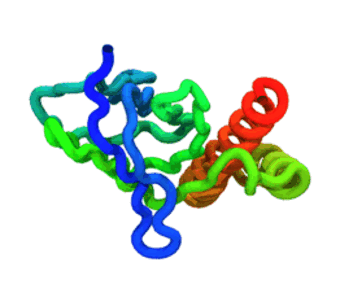

# Tutorial A.5 — Optimizing the contact nscale (*n*<sub>scale</sub>)

**Goal:** instead of *hard-coding* the per-domain and per-interface contact
nscales in `domain.yaml` (as in [Tutorial A.2](A2_multidomain.md)),
this tutorial **searches** for them automatically, so the force field is just
strong enough to keep the native structure of every domain and interface folded.

> The quantity being optimized is the `nscale` field in `domain.yaml`
> (*n*<sub>scale</sub> in the literature). The optimizer
> *chooses* those values for you — `intra_domains[...].nscale` for each domain
> and `inter_domains` for each interface.

**Time:** minutes on a GPU (10 copies × short MD × up to 6 rounds); longer for a
production-length protocol.

**Prerequisites:** [Tutorial A.2](A2_multidomain.md)
(what `nscale` does) and [Tutorial A.4](A4_multicopy.md)
(the multi-copy runs the optimizer uses to collect independent trajectories).



***One stability trajectory** — each round runs 10 of these; the fraction that stay folded (via Q) decides whether the current `nscale` passes or is raised.*

---

## Files in this folder

| File | Role |
|------|------|
| `P0A6E6.pdb` | All-atom reference structure (139 residues, two domains). |
| `domain.yaml` | Initial domains: residue ranges + structural **`class`**. The `nscale` here is a placeholder the optimizer overwrites. |
| `optimize.ini` | **Minimal** config for the optimizer (the new ingredient). |
| `optimization.py` | Thin shim to `topo.optimize` (the optimizer; same as `topo-optimize`). |
| `run_simulation.py` | Thin shim to `topo.mdrun` (the per-round MD engine). |
| `data/` | Legacy CHARMM/SLURM reference implementation — not used; kept for provenance. |

## 1. The problem

A single contact nscale rarely fits a whole protein. Too low and a domain
unfolds during the simulation; too high and you over-stabilize the fold and wash
out the dynamics you want to study. A multidomain protein needs a **separate**
nscale for every domain *and* every domain–domain interface — tedious and not
reproducible to choose by hand. The optimizer searches for the **smallest**
nscale, drawn from a small discrete ladder, at which each domain and interface
stays folded across many independent trajectories.

## 2. Basic theory

The native contact interactions are divided into groups by the **domains**
(e.g. from the [CATH database](https://www.cathdb.info/)). Each domain starts at
the **level-1** nscale for its structural class (α, β, α/β, or *interface*;
Table 1).

Then **`ntraj` independent MD trajectories at the reference temperature
(`ref_t`)** are run for the current CG
model, and the *Q* value (fraction of native contacts formed) of every domain and
interface is monitored. A domain/interface is **stable** when **all** `ntraj`
trajectories keep its *Q* above the threshold **Q = 0.6688** for **≥ 98 %** of the
frames.

Any unit that fails has its `nscale` raised to the **next level**, while the
already-stable ones keep their current value; a new model is generated and the
test repeated until everything is stable. If a unit still cannot be stabilized at
the highest level, the **median** nscale of its class (level 3) is used for the
final model regardless of stability.

**Table 1.** `nscale` (*n*<sub>scale</sub>) levels per structural class.

| Structural Class | Level 1 | Level 2 | Level 3 | Level 4 | Level 5 |
| ------ | ------ | ------ | ------ | ------ | ------ |
| &alpha; | 1.1954 | 1.4704 | 1.7453 | 2.0322 | 2.5044 |
| &beta; | 1.4732 | 1.8120 | 2.1508 | 2.5044 | 2.5044 |
| &alpha;/&beta; | 1.1556 | 1.4213 | 1.6871 | 1.9644 | 2.5044 |
| Interface | 1.2747 | 1.5679 | 1.8611 | 2.1670 | 2.5044 |

> Calibrated on a training set of 19 small single-domain proteins
> ([Leininger et al., *PNAS* **116**, 5523–5532, 2019](https://www.pnas.org/doi/full/10.1073/pnas.1813003116)).

## 3. The search algorithm (per round)

Each **round** is one set of nscales tested. For each round the optimizer:

1. **Writes** `round_N/domain.yaml` with the current nscales.
2. **Runs** one multi-copy MD (`topo.mdrun` with `n_copies = ntraj`) → `ntraj`
   independent chains in a single run, and **splits** the combined trajectory
   into per-copy DCDs (`topo.split_chains`).
3. **Scores** *Q* per frame for every domain and interface
   (`topo.analysis.native_contacts`).
4. **Decides** per unit: a unit is *stable* if **all** `ntraj` trajectories are
   folded (*Q* > 0.6688) for ≥ 98 % of frames.
   - All units stable → **done**.
   - Otherwise each **unstable** unit climbs one ladder level (stable units stay
     frozen) and the next round runs.

Within a single round, every **currently** unstable unit climbs one level while
stable units stay frozen, so units that are unstable *at the same time* advance in
parallel. If the units were fully independent, six rounds would always suffice
regardless of their number — five ladder levels plus the median (level-3)
fallback. A unit still unstable at the top of the ladder is pinned at that
fallback for the final model.

The units are **not** independent, however: domains and their shared interfaces
are coupled through the native-contact map, so **raising one unit's nscale can
destabilize a unit that had already stabilized**, forcing it to start climbing
again. Because that re-climbing happens *after* the first unit has settled, the
worst-case number of rounds is **not** bounded by the ladder height — it grows
with the number of units, up to roughly *(number of units) × (ladder levels)* in
the extreme. For example, with two domains D1, D2 (plus their interface): D2 may
need until round 5 to reach level 5 and finally fold, but that high D2 nscale then
destabilizes D1 (previously stable at level 1), which must now climb 1→5 over the
next several rounds — on the order of **ten rounds** for a two-domain protein.

`max_rounds` therefore defaults to **6** only as a **heuristic**, not a physical
bound: it covers the common case (weak or no coupling, where a unit made stable
almost always stays stable as the other units' nscales change) and keeps the
default run short. Strongly coupled multidomain systems can legitimately need
more, so **raise `max_rounds`** for them. Any unit still unstable when
`max_rounds` is reached is flagged with a **WARNING** in the report, so you can
inspect it, increase `max_rounds`, or exclude it.

## 4. Run it

```bash
topo-optimize -f optimize.ini -o opt_out
```

That's the whole command (the installed console script). Equivalent forms:
`python -m topo.optimize -f optimize.ini -o opt_out`, or the in-folder shim
`python optimization.py -f optimize.ini -o opt_out`. Watch progress live with `tail -f opt_out/optimization.log`
(it marks each round's MD/scoring phase) and `opt_out/round_N/traj/traj.log` (the
live MD step counter).

> Testing overrides: `--device CPU` and `--md-steps N` override `optimize.ini`
> for a quick local run.

## 5. The `optimize.ini` config

`optimize.ini` is deliberately **minimal** — only the essentials, in a **single
flat key list**. The optimizer takes the keys it needs (`ntraj`,
`q_threshold`, `frame_fraction`, `max_rounds`, `min_contacts`); every other key is
a simulation parameter passed through to each round's `md.ini`. Everything else
(timestep, thermostat, model, device, output naming, …) comes from the
optimizer's built-in protocol defaults, so you don't repeat a full `md.ini`.

```ini
# inputs + simulation parameters (passed through to each round's md.ini)
pdb_file   = P0A6E6.pdb        ; all-atom reference (native contacts + geometry)
domain_def = domain.yaml       ; initial domains + class; nscales get optimized
md_steps   = 100000            ; steps per trajectory
nstxout    = 100               ; trajectory output frequency (frames feed Q)
nstlog     = 100
ref_t      = 310               ; K

# optimizer controls (consumed by optimization.py)
ntraj          = 10            ; independent trajectories per round (= n_copies)
q_threshold    = 0.6688        ; a frame is "folded" for a unit if Q > this
frame_fraction = 0.98          ; a trajectory is "stable" if >= this fraction folded
max_rounds     = 6             ; 5 ladder levels + median fallback
min_contacts   = 0             ; units with fewer native contacts than this are
                               ;   pinned at level 1 and not optimized (0 = off)
```

> **Recommended production settings.** The `md_steps` above is a fast demo value.
> For a reliable nscale optimization, use **`ntraj = 10`** with each trajectory run
> for **1 µs** (at `dt = 0.015` ps that is `md_steps ≈ 66,700,000`). Ten
> independent 1 µs trajectories give enough sampling for the per-unit stability
> test to be robust.

A domain or interface with fewer than `min_contacts` native contacts is treated as
too weakly structured to fold: it is **pinned at the first ladder level and excluded
from optimization** (it never climbs and never blocks convergence). This is useful
for interfaces between domains that barely touch, or small/disordered domains that
would otherwise spuriously read as "unstable" and waste rounds. The default `0`
disables the check.

> **Recommended value.** `min_contacts = 25` is a reasonable heuristic: below
> roughly this many native contacts a domain or interface is too weakly
> structured to support a stably folded unit, so it should be pinned rather than
> optimized ([Zhang et al., *Science* **390**, eadt1630, 2025](https://www.science.org/doi/10.1126/science.adt1630)).

Each round the optimizer expands this into a full `round_N/md.ini` (one implicit
default worth knowing: `dt = 0.015` ps, the model's 15 fs timestep).

## 6. The `domain.yaml` — note the `class` field

Same format as Tutorial A.2, plus a **`class`** per domain (the only field the
optimizer needs beyond `residues`):

```yaml
n_residues: 139
intra_domains:
  A:
    residues: [1-90]
    class: beta            # alpha | beta | alpha-beta  (selects the ladder)
    nscale: 1.1556       # placeholder — overwritten each round
  B:
    residues: [91-139]
    class: alpha
    nscale: 1.6871
inter_domains:
  A-B: 1.8611              # placeholder too
```

`class` picks which Table-1 ladder a domain climbs; interfaces always use the
*Interface* ladder. (`class` is ignored by `topo.mdrun`/`run_simulation.py`, so
the same file works for production runs.) For the full field reference —
including the accepted `class` values and the domain-naming rules — see
[Domain definition file](../usage/domain_definition.rst).

## 7. What it produces

Under the `-o` directory:

| Path | Contents |
|------|----------|
| `optimization.log` | The report: native-contact counts, and per round the chosen nscales + per-unit stability, ending in the **final** nscales (or a WARNING). |
| `round_N/domain.yaml`, `round_N/md.ini` | The exact inputs used that round. |
| `round_N/traj/` | The MD outputs (`traj.dcd`, `traj.psf`, …), the per-copy DCDs `traj_<k>.dcd`, and one **`Q_<k>.csv`** per trajectory (`frame, Q_<domain>…, Q_<interface>…`). |
| **`domain_optimized.yaml`** | The calibrated model — the result. |

## 8. Under the hood (reusable package pieces)

- **`topo.analysis.native_contacts`** — the *Q* scorer. Native contacts are
  defined from the all-atom reference (heavy-atom distance ≤ 4.5 Å, between
  residues more than 3 apart in sequence); a contact is *formed* in a CG frame
  when d<sub>CG</sub> ≤ 1.2 × d<sub>native</sub>. It emits one *Q* column per
  domain and per interface. Use it standalone too:
  ```bash
  python -m topo.analysis.native_contacts -d domain.yaml -r ref.pdb \
      -p traj/traj.psf -f traj/traj.dcd -o Q.csv
  ```
- **`topo.split_chains`** — splits a combined multi-copy DCD into per-copy DCDs
  via memory-bounded streaming (handles trajectories too large for RAM). CLI:
  `python -m topo.utils.multichain -f combined.dcd -n N -o out/`.

## 9. Run production with the optimized nscale values

`domain_optimized.yaml` is a ready-to-use domain definition file — point a
production run's `domain_def` straight at it (the extra `class` field is harmless):

```ini
# md.ini
domain_def = domain_optimized.yaml
```
```bash
topo-mdrun -f md.ini
```

## Try next

- Tighten/loosen the criterion (`q_threshold`, `frame_fraction`) and watch the
  converged levels shift.
- Increase `md_steps` toward the published ~1 µs protocol for production
  calibration (the demo value is short).

> **Status:** the optimizer is a package module (`topo.optimize`, exposed as the
> `topo-optimize` console command); the *Q* scorer and trajectory splitting are
> stable package functions. The one remaining limitation is optimization-level
> restart/resume (each invocation starts fresh).
