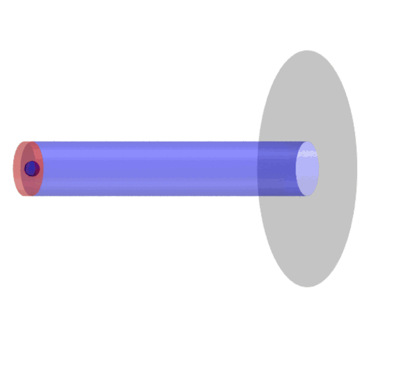

# Tutorial B.1 — Protein synthesis through an analytic exit tunnel

This is the **structure-based (topo) twin** of cosmo's tutorial 09. The
ribosome-based runner ([Tutorial B.2](B2_ribosome_synthesis.md))
builds the ribosome from **explicit beads** and threads the nascent chain through
the coarse-grained exit tunnel. Here the tunnel is modelled
**analytically** instead: a cylindrical **bore** of radius `r` along the X-axis
drilled through an **infinite wall** at `x_exit` (a "hole in an infinite wall").
There are **no ribosome beads** — the System is the nascent chain only, so it is
fast and never jams.

The chain is a **folded protein** built with topo's structure-based Gō contacts, so
it can **fold co-translationally** as it extrudes and once it clears the bore.



***Protein synthesis → ejection.** The chain (N→C rainbow beads) grows from the PTC (C-terminus, red) and extrudes N-terminus-first down the transparent blue **bore** (with the red closed PTC cap and the translucent grey **exit-face wall**), emerges past the wall, and folds into the ejected protein just outside the tunnel.*

## The cylinder ribosome model (`topo.csp.cylinder`)

The analytic tunnel is a different *physics of confinement* than the explicit-bead
ribosome, so it lives in the package as a **parallel module** to the explicit-bead
runner (`topo.csp.protocol`): [`topo.csp.cylinder`](../../topo/csp/cylinder.py),
driven by the `topo-cylinder` console command. It **reuses** the package's tested,
unchanged low-level machinery from `topo.csp.core` (the one-time contact precompute,
the build-once-subset length model, the seed / restrain / output path) and adds only
the one new force, `add_tunnel_cylinder`, plus its own nascent-only synthesis loop.

Timing is the **same O'Brien codon kinetics** as `topo-csp` — each residue's MD length
comes from its codon dwell time (`mrna` + `scale_factor`) via `topo.csp.kinetics`. The
only difference from the explicit protocol is that the cylinder runs a **single MD
segment per residue** (there is no A→P translocation to split into three sub-stages).

## The model (forbidden region `S`)

```
   d                              (cytosol: free, any d)
   ^   |##### solid ribosome S #####|
 r |···|············ bore ··········|··············>  allowed past exit
   +---|----------------------------|----------------> x
     x_lo (PTC)                  x_exit
       |##### solid ribosome S #####|
                              ^ infinite exit-face wall (d > r)
```

A bead is penalised by its **penetration depth into `S`** (everything outside the
bore up to the exit face, plus the closed PTC end), escaping via whichever face is
nearer — the bore wall (radial inward push → keeps the chain extended) or the exit
face (`+x` push → a cytosol bead can re-enter the tunnel **only through the bore**).
The 90° mouth corner is rounded by a fillet (radius `rho`) so the potential is
continuous and the MD is stable. The C-terminus is seeded and position-restrained
on the tunnel axis at the PTC `(x_lo, 0, 0)`; new residues are seeded there.

## Run

```bash
cd tutorials/B1_translation_cylinder
topo-cylinder -f cylinder.ini          # or: python -m topo.csp.cylinder -f cylinder.ini
```

All parameters live in [`cylinder.ini`](https://github.com/vuqv/topo/blob/main/tutorials/B1_translation_cylinder/cylinder.ini). The
nascent chain is the 106-residue P0CX28, with `domain.yaml` + the precomputed STRIDE
for the contact map, and `P0CX28_mrna.txt` for the codon kinetics. Tunnel defaults:
bore radius **0.9 nm**, length **10.0 nm** (`x_lo=0`, `x_exit=10`), axis on X, mouth
fillet **0.2 nm**, wall stiffness **8368 kJ/mol/nm²**. The kinetics keys (`mrna`,
`scale_factor`, `time_stage_1/2`, `max_steps_per_stage`) are the **same** as the CSP
tutorials; the demo caps each residue at 2000 steps (delete the clamps for production).

## Post-synthesis: ejection

Once the chain reaches its final length, an optional **post-synthesis free run**
continues the same system from the finished structure — the **same `ejection_steps`
key as `topo-csp`**. The phase **releases** the C-terminus restraint, so the completed
protein is free to diffuse; the analytic tunnel stays on (bore + closed PTC end + exit
wall), so the only way out is +x through the exit. This tests whether the nascent
protein **diffuses out of the tunnel and folds in the cytosol**.

- **`ejection`** (`ejection_steps`) — the free run, written to `<outdir>/ejection/`.

```ini
ejection_steps     = 300_000   # use a LONG run so the protein can clear the tunnel
```

## Visualize / validate

Stitch the per-length trajectories into one movie **and** draw the analytic tunnel
(bore tube, closed PTC cap, and the infinite exit-face wall as an annulus whose hole
is the bore), reading the geometry from the same `cylinder.ini`. Two equivalent ways:

```bash
# Module (preferred): the shared stitcher with a --tunnel flag.
topo-csp-movie -o synth_out --tunnel cylinder.ini      # or: python -m topo.csp.movie -o synth_out --tunnel cylinder.ini
cd synth_out && vmd -e movie.tcl                       # movie.tcl loads movie.{psf,dcd} by name -> run it from synth_out/
```

```bash
# In-folder script (equivalent; self-contained convenience wrapper).
python make_movie_cylinder.py -o synth_out -f cylinder.ini
cd synth_out && vmd -e movie.tcl                       # run from synth_out/ so movie.{psf,dcd} resolve
```

Both draw the same tunnel from the same `topo.csp.cylinder.tunnel_tcl` geometry
(`--wall-outer NM` sets the drawn exit-wall radius; default bore radius + 3 nm).
You then see the chain thread the (blue, transparent) bore, the red PTC end cap it
grows away from, and the grey exit wall it emerges through — then fold once it
clears the tunnel. (Plain `topo-csp-movie -o synth_out`, with no `--tunnel`, also
works — it just omits the tunnel.)

For the full movie reference (both synthesis models, all `topo-csp-movie` options),
see [Visualizing the synthesis process](../usage/synthesis_visualization.md).
